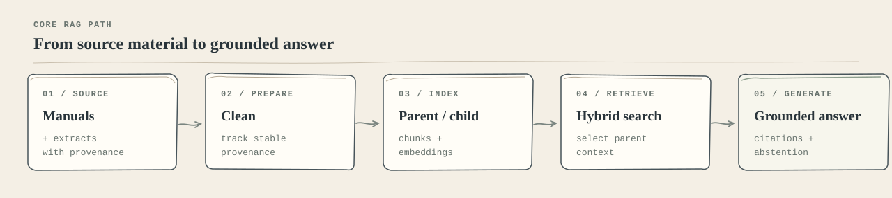
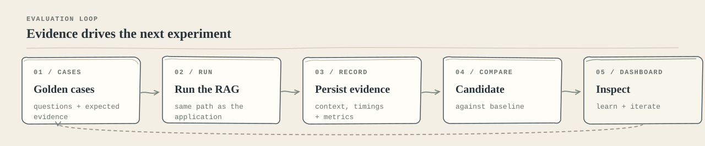

# Aviation RAG Agent

[](assets/core-rag-pipeline.svg)

This is not primarily a package for someone to download and run. It is a working case study: every important layer is implemented explicitly so that retrieval quality, context selection, latency and failure modes can be inspected instead of hidden behind a framework.

The corpus combines aircraft manuals, specification sheets and curated aviation extracts. The system answers technical questions with source-aware context, citations and an explicit abstention path when the evidence is missing.

## Why this project exists

The interesting problem is not generating fluent aviation text. It is deciding whether the answer is supported by the right evidence, then being able to explain why a change improved or damaged the system.

That leads to four design priorities:

- **Retrieval before generation:** improve the evidence path before tuning the prompt or model.
- **Context with structure:** search small units for precision, but give the model enough surrounding material to understand the fact.
- **Evaluation as a first-class system:** every experiment is stored, reproducible and comparable against a baseline.
- **Visibility over convenience:** the database, traces and dashboard preserve what happened at each stage.

The main path is deliberately small:

| Stage | What happens | Why it matters |
| --- | --- | --- |
| **Ingest** | PDFs and text extracts are cleaned, normalised and assigned stable provenance. | A result can be traced back to a document and source file. |
| **Structure** | Each document becomes larger `parent` windows and overlapping smaller `child` chunks. | Matching stays precise without starving generation of context. |
| **Index** | Child chunks receive embeddings; PostgreSQL builds a generated `tsvector` and GIN index. | Semantic and exact-term retrieval are available from the same corpus. |
| **Retrieve** | Vector and keyword rankings are fused with Reciprocal Rank Fusion, then collapsed to unique parents. | Exact aviation tokens and semantic questions can both succeed. |
| **Generate** | The model sees only selected parent context and must cite the aircraft and source. | The answer remains grounded and auditable. |
| **Evaluate** | Runs persist rankings, context, answers, timings, tokens and metrics. | A change can be judged by evidence, not by a convincing demo query. |

## Decisions that shape the system

### 1. Parent-child chunking

Chunking is implemented in `ingestion/chunking.py`, rather than delegated to a framework splitter.

```text
document
  -> paragraph-aligned parents      ~2,000 characters
  -> overlapping searchable children ~500 characters, 100 overlap
```

Children are embedded because small passages give more focused matches. Parents are not embedded; they are the richer context returned to the model. In short: **search small, return big**.

This also makes retrieval measurable at two levels: whether the right child was found, and whether the final parent context was useful without repeating the same document several times.

### 2. Hybrid search instead of vector-only search

Vector similarity is good at meaning, but it can underweight exact identifiers and aviation notation such as `V1`, `Vso`, model variants or part numbers. PostgreSQL therefore runs two independent retrieval legs:

- HNSW over `text-embedding-3-small` vectors.
- GIN full-text search over a generated English `tsvector` column.

The database function `find_similar_parents_hybrid` fuses ranks with:

```text
RRF(parent) = sum(1 / (60 + rank))
```

Rank fusion avoids putting cosine distance and keyword scores on an arbitrary shared scale. It also keeps the retrieval contract in the database, close to the indexes, rather than scattering ranking logic through application code.

### 3. Idempotent, observable ingestion

Stable document, parent and child IDs make ingestion safe to repeat. Children and parents are upserted separately, embedding calls run in batches, API and database operations retry with backoff, and failed child IDs are reported for selective re-runs.

Before indexing, every child is scanned for prompt injection. Suspicious or unscannable material blocks ingestion and is logged for review rather than silently discarded. This matters for technical documents because a false positive may still contain legitimate operational language.

### 4. Grounded generation with an abstention path

The generator receives retrieved context inside explicit data boundaries. Its contract is intentionally conservative:

- use only the supplied context;
- cite the aircraft and source;
- report conflicting values instead of choosing silently;
- preserve numeric precision;
- return `I don't have that information in my sources.` when the corpus does not support an answer.

Input validation, local Prompt Guard, OpenAI moderation and output leak checks form a fail-closed defence in depth. Security is applied when untrusted text enters the system: both at ingestion and at query time.

## NTSB integration

The project also includes a structured aviation accident index from the NTSB public API. NTSB records are not embedded into the manual/vector corpus; they live in a separate relational schema optimised for exact filters, counts and rankings.

The NTSB architecture has two explicit paths:

- **Synchronization:** `NTSB API -> normalizer -> PostgreSQL ntsb schema -> checkpoint`.
- **Query:** `question -> planner -> PostgreSQL repository -> optional selected-case detail refresh -> grounded answer`.

The API key is used by the sync/detail process, not by broad interactive searches. Interactive questions never scan historical ranges through the API. Rankings such as “most deaths in the past 10 years” and counts are computed by PostgreSQL over the local index.

Useful commands:

```bash
python -m ntsb.sync.cli backfill
python -m ntsb.sync.cli incremental
python -m ntsb.sync.cli status
```

Backfill and incremental sync hydrate selected case details by default so fields such as fatalities, probable cause, events and findings are available for SQL rankings and generated answers. Use `--summary-only` only for diagnostics.

Backfill skips cases whose `mkey` already exists, so reruns are fast and do not overwrite enriched records. Use `python -m ntsb.sync.cli backfill --refresh-existing` only when intentionally rebuilding existing records from the API.

To run the interactive NTSB query flow after the index has been populated:

```bash
python -m rag.query_test_ntsb
```

## Evaluation is the decision loop

The project treats evaluation as infrastructure, not as a final report. The runner executes the same RAG path used by the application and persists the complete evidence chain for every case.

[](assets/evaluation-loop.svg)

The first dataset, `aviation_golden_v1`, contains 36 English cases built from the downloaded sources, including an explicit out-of-corpus question. Golden answers and evidence live in the separate `evaluation` PostgreSQL schema; they never become searchable RAG context.

The deterministic retrieval layer currently tracks:

- `Recall@k`, `Precision@k`, `HitRate@k`, `MRR` and `nDCG@k`;
- duplicate ratio and unique-parent ratio;
- retrieved item count and estimated retrieved tokens;
- latency, input/output/context tokens and recorded cost;
- abstention decisions and the generated answer for each case.

This separation helps answer two different questions:

1. **Did retrieval find the right evidence, and how high did it rank?**
2. **What did the model actually receive, and what did it produce?**

Generation metrics such as citation correctness, faithfulness and answer correctness can be added on top of this deterministic baseline without losing the underlying retrieval evidence. LangSmith adds a visual trace for each evaluated case and its trace ID is stored with the database result.

## The dashboard

`Aviation RAG Evaluations` is a read-only Streamlit surface for inspecting decisions, not a generic chat demo. It exposes three useful views:

| View | What it answers |
| --- | --- |
| **Overview** | Is the run healthy? How are quality, latency and resource usage trending? |
| **Run Comparison** | Did a candidate beat the baseline, and what was the trade-off in context, cost or latency? |
| **Case Explorer** | Which question changed, what evidence was golden, what was retrieved and what context reached generation? |

The dashboard automatically chooses a compatible baseline from the same dataset. Comparisons also surface mismatches in corpus, prompt version and retrieval budget, because a raw score delta is misleading when the experiment changed more than one variable.

## Repository map

```text
ingestion/       document cleaning, parent-child chunking and embedding/upsert
rag/             retrieval, generation, guardrails and structured results
ntsb/            NTSB planner, PostgreSQL repository and API synchronization
assets/          responsive SVG diagrams used by this README
evaluation/      dataset runner, manifest handling and deterministic metrics
dashboard/       read-only Streamlit views over persisted evaluation runs
db/              pgvector, full-text search and evaluation schema
data/raw/        source manuals, PDF text extracts and aviation extracts
tests/           unit, integration and end-to-end coverage
```

The implementation intentionally avoids LangChain abstractions for the core path. LangSmith is used where it adds value: tracing and visual inspection of runs.

## Running the project

Operational setup is intentionally kept secondary to the design. For maintainers who want to reproduce the pipeline:

```bash
python configure.py
```

Configuration lives in `.env`; the expected variables are documented in `.env.example`. The evaluation dashboard has its own lightweight dependencies:

```bash
python -m pip install -r dashboard/requirements.txt
python -m streamlit run dashboard/app.py
```

Tests:

```bash
pytest tests
```

The NTSB index can be synchronized and queried independently from the indexed-document path:

```bash
python -m ntsb.sync.cli incremental
python -m rag.query_test_ntsb
```

## Current boundary and next experiment

The indexed-document path and the NTSB case index are separate retrieval systems over the same PostgreSQL project. The next architectural step is a routing agent that chooses between manuals, NTSB records or both, followed by generation-quality evaluation with RAGAS-style metrics.

## What "done" means here

Not an answer that sounds right once.

An answer that is supported by the right source, whose retrieval path can be inspected, whose changes can be compared against a baseline, and that is willing to say when the evidence is not there.
